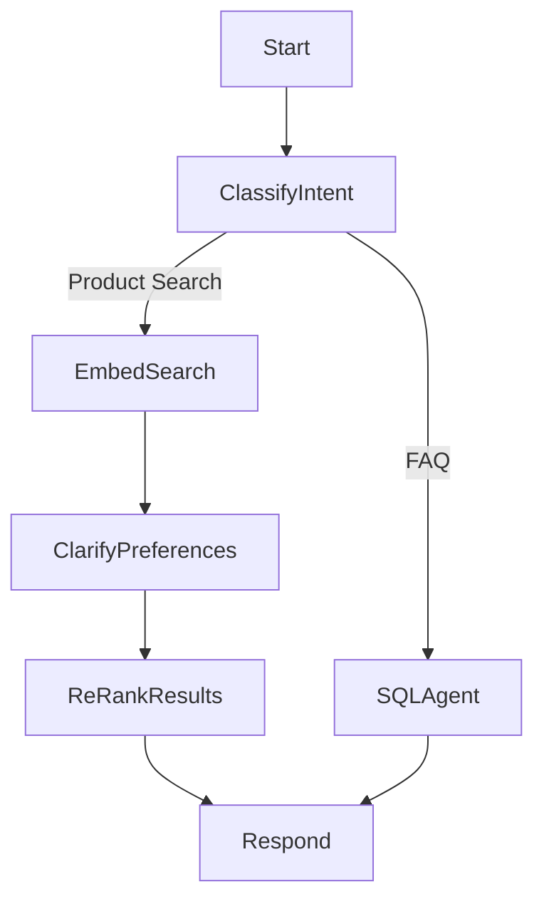

# 🛍️ AI-Powered Retail Shopping Assistant

An end-to-end GenAI-powered shopping assistant that helps users identify and purchase products based on preferences through both text and image input.

---

## 🚀 Features

- 🔍 **Multimodal Search**: Retrieve products using both image and text.
- 🧠 **Intent Classification**: Detects whether query is FAQ or product search.
- 📊 **Text2SQL Agent**: Converts natural language to SQL queries.
- 🔗 **Weaviate Vector Search**: Retrieves similar products using embeddings.
- 🧵 **LangGraph Coordination**: Orchestrates agent flow using LangGraph DAGs.
- 🧩 **Extensible Schema**: Easily supports new product types and metadata fields.

---

## 🧪 Quick Start

### 1. Clone the repository

```bash
cd shopping-assistant
````

### 2. Install dependencies

```bash
python3 -m venv .venv
source .venv/bin/activate
pip install -r requirements.txt
```

### 3. Add environment config

Update `config.py` with your credentials:

* `ENDPOINT_URL`
* `AZURE_OPENAI_API_KEY`
* `DEPLOYMENT_NAME`

---

## 📦 Data Preparation

### Step 1: Populate Weaviate with product data

```bash
python design_time/weaviate_ops/add_tshirts.py - already done
python design_time/weaviate_ops/add_tvs.py - already done
```

### Step 2: Test Text2SQL CLI (optional)

```bash
python design_time/generation/text2sql_agent.py
```

---

## 🧠 LangGraph Agent Architecture



---

## 🧩 Extending the System

| Component                | You Can Add...                                       |
| ------------------------ | ---------------------------------------------------- |
| `schema.py`              | New product attribute tables                         |
| `text2sql_agent.py`      | Enhanced SQL prompt logic                            |
| `nodes/`                 | New LangGraph modules (e.g., filters, price sliders) |
| `weaviate_helper.py`     | Additional query and deletion logic                  |
| `embedding_generator.py` | Use other embedding models like CLIP or ViT          |

---

## 🔗 Integrations

* **LangGraph**: For building branching dialogue workflows.
* **Weaviate**: Vector DB for text/image similarity.
* **Azure OpenAI**: Text2SQL and clarification prompt generation.
* **FastAPI**: Embedding microservice server (optional).

---

## 💡 Sample Queries You Can Ask

* What are the most expensive t-shirts?
* Show me Nike products under ₹2000.
* What is the average price of a TV?
* List all red color t-shirts.
* How many Smart TVs do you have?
* What’s the price range of fashion items?

---

## 📚 References

* [LangGraph Documentation](https://docs.langgraph.dev)
* [Weaviate Docs](https://weaviate.io/developers/weaviate)
* [Azure OpenAI](https://learn.microsoft.com/en-us/azure/cognitive-services/openai/)
* [LangChain](https://docs.langchain.com/)

---


## 👨‍💻 Author

**Aravinda Sai Gadamsetty**
[LinkedIn](https://linkedin.com/in/aravindasai2504)

